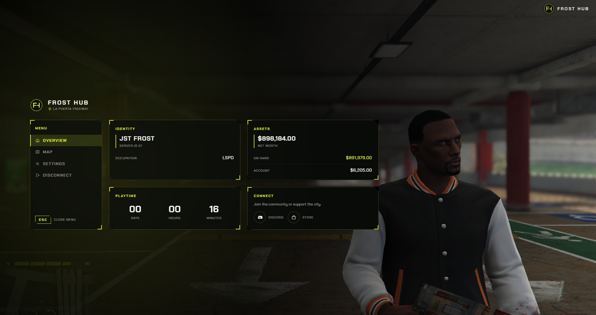
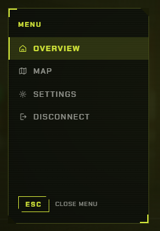
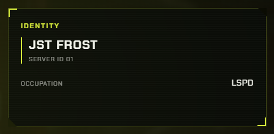
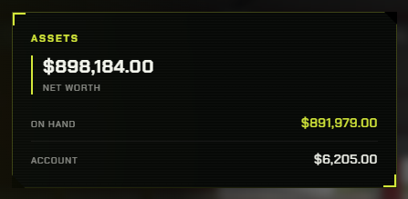
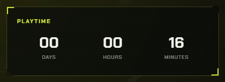
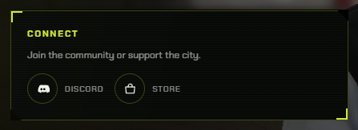
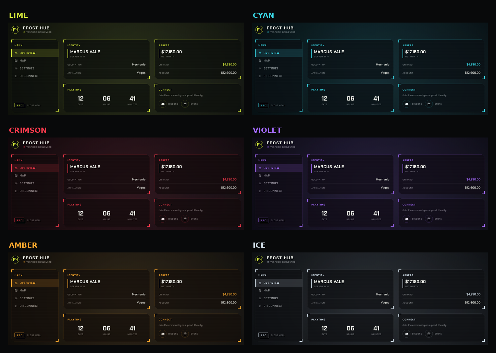
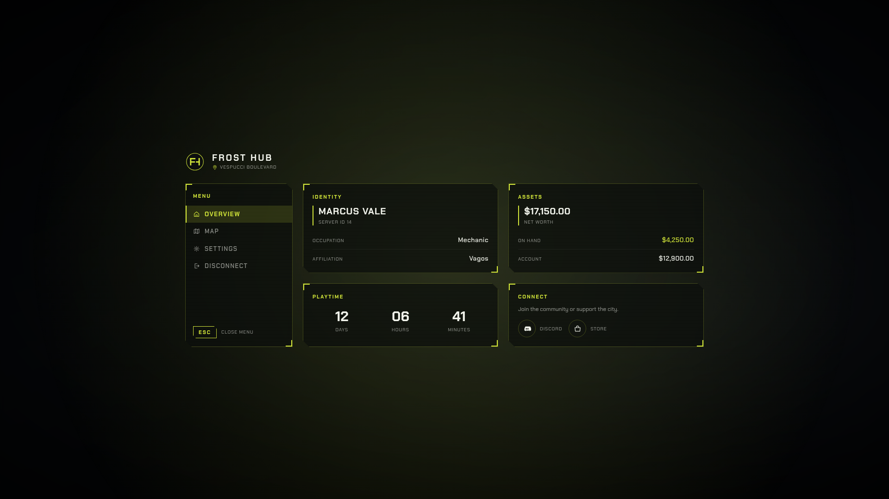

# FiveM Pause Menu

[](LICENSE)


A custom in-game pause menu for FiveM, compatible with **ESX**, **QBCore**
and **QBX** (Qbox). It replaces the default GTA pause screen with a
HUD-style console: a side camera framing your character, panels of live
character data, and shortcuts to the game map, the game settings and your
community links.

It shares its visual language and color presets with the Frost Hub loading
screen, so the two resources look like one system.



---

## Features

- **Cinematic side view** — a scripted camera frames the character while
  they pull out a map, or a plain centered overlay if you prefer
- **Live character data** — name, server ID, occupation, optional gang,
  cash on hand, bank balance and net worth, read on every open
- **Built-in playtime tracking** — stored in its own table, so it works the
  same on every framework and never touches your core's tables
- **Map & settings shortcuts** — jump straight into the game map or GTA's
  native settings menu
- **Community links** — Discord and store buttons that open in the player's
  browser
- **Six color presets** — the same ones the Frost Hub loading screen ships
  with, plus per-key overrides
- **Four languages** — English, Italian, Spanish, French, easy to extend
- **Self-contained** — the font is bundled, the interface makes no external
  requests, and it scales from 1080p to 4K

---

## Requirements

- [`ox_lib`](https://github.com/overextended/ox_lib) — callbacks between
  client and server
- [`oxmysql`](https://github.com/overextended/oxmysql) — playtime storage

---

## Installation

1. Copy the folder into your server's `resources` directory.
2. Import `sql/install.sql` into your database. It creates a single table,
   `frosthub_playtime`, and never touches your framework's own tables.
3. Make sure **`ox_lib`** and **`oxmysql`** start before this resource.
4. Add `ensure frosthub_pausemenu` to your `server.cfg`.
5. Restart the server.

> If you rename the folder, also update the name after `ensure`, the `name`
> field in `fxmanifest.lua`, and `RESOURCE_NAME` in
> `web/src/lib/nuiClient.js` (then rebuild the interface).

---

## Quick customization

Everything is configured from **`config/settings.lua`**. The things you'll
want to change first:

```lua
Config.ServerName = 'FROST HUB'
Config.Locale     = 'en'      -- en | it | es | fr
Config.Theme      = 'lime'    -- lime | cyan | crimson | violet | amber | ice

Config.Links = {
    discord = 'https://discord.gg/yourinvite',
    store   = 'https://store.tebex.io/yourserver',
}
```

The framework is detected automatically on start. Force it only if the
autodetect picks the wrong one:

```lua
Config.Framework = 'auto'   -- auto | esx | qb | qbox
```

---

## Menu rail



| Entry | What it does |
|---|---|
| **Overview** | The view you are already on |
| **Map** | Closes the menu and opens the game map directly |
| **Settings** | Opens GTA's native settings menu |
| **Disconnect** | Drops the player from the server |
| **ESC** | Closes the menu, same as pressing the `ESC` key |

---

## Panels



**Identity** — character name, server ID and occupation. The *Affiliation*
row is optional and hidden by default (as in the screenshot above); enable
it by setting `Config.GangResolver` in `config/settings.lua`:

```lua
-- pick one
Config.GangResolver = 'qbcore'        -- reads PlayerData.gang.label
Config.GangResolver = 'qbox'          -- same, from qbx_core
Config.GangResolver = 'rcore_gangs'   -- exports.rcore_gangs:GetPlayerGang

-- or resolve it yourself, for any gang script
Config.GangResolver = function(source)
    return exports['my_gang_script']:GetGang(source)
end
```



**Assets** — net worth, with cash on hand and bank balance broken out below.



**Playtime** — total time on the server, split into days, hours and minutes.



**Connect** — opens your Discord invite and store page in the player's
browser, from `Config.Links`.

---

## Playtime tracking

Playtime is stored by this resource in its own `frosthub_playtime` table,
so it behaves identically on ESX, QBCore and QBX and never requires an
`ALTER TABLE` on your framework's tables.

It adds a minute to every online player each minute, writes to the database
every five minutes, and flushes on player disconnect and on resource stop,
so a restart does not lose progress. While the menu is open its panels
refresh once a minute, so the counter keeps moving as you watch it.

---

## Colors



Pick a preset with `Config.Theme`. These are the same six presets the
Frost Hub loading screen ships with — set the same name in both resources
and they match:

| Preset | Style |
|---|---|
| `lime` | lime green, street racing (default) |
| `cyan` | cyan, tech / cyberpunk |
| `crimson` | red, aggressive |
| `violet` | purple, nightlife |
| `amber` | amber, warm |
| `ice` | icy white, minimal |

Want to tweak just one shade? Anything set in `Config.ThemeOverride`
**overrides** the preset, so you can start from one and change the bare
minimum:

```lua
Config.Theme = 'cyan'
Config.ThemeOverride = {
    accent = '#00ff88',   -- only the accent, the rest stays from the preset
}
```

Available keys: `accent`, `accentSoft`, `panelBg`, `panelBorder`,
`textPrimary`, `textSecondary` — the same names the loading screen uses.
(The loading screen also defines `background`, `barEmpty` and `barFilled`;
the pause menu has no use for them since it renders over the running game.)
To create your own preset, copy a block in `Config.Themes` and reference it
from `Config.Theme`.

---

## Camera & animation



By default the console sits on the left while a scripted camera frames the
character from the side, as they pull out a map. Turn the camera off for a
centered layout over a dimmed screen (pictured above) — that is also what
players sitting in a vehicle get, since the camera is skipped there:

```lua
Config.Camera = {
    enabled = true,      -- false = centered layout, no camera
    distance = 1.8,      -- how far the camera sits from the player
    height = 0.6,        -- how high above the player
    transitionMs = 1000,
}

Config.Animation = {
    enabled = true,      -- false = no map prop, no animation
    dict = 'amb@world_human_tourist_map@male@base',
    anim = 'base',
    prop = 'prop_tourist_map_01',
}
```

The interface is authored at 1080p and scaled to the player's resolution,
so it keeps the same proportions on 1440p and 4K.

---

## Keybind

`ESC` by default. Players can rebind it from FiveM's own keybind settings.

```lua
Config.Keybind = {
    command = 'frosthubmenu',
    defaultKey = 'ESCAPE',
    label = 'Open Pause Menu',
}
```

---

## Language & translations

Set `Config.Locale` to `"en"`, `"it"`, `"es"` or `"fr"`.

Every interface text lives in **`locales/`**, one file per language. To add
a language: copy `locales/en.lua`, rename it (e.g. `de.lua`), change the
table key at the top to `Locale.packs.de`, translate the values and set
`Config.Locale = 'de'`. New files are picked up automatically.

---

## Editing the interface

The interface is a React app in `web/`, already compiled into `web/dist`.
You only need to rebuild if you change something inside `web/src`:

```bash
cd web
npm install
npm run build
```

---

## Structure

```
frosthub_pausemenu/
├── fxmanifest.lua
├── README.md
├── LICENSE
├── img-preview/          <-- screenshots used by this README
├── config/
│   ├── settings.lua      <-- all settings, themes and links
│   └── locales.lua       <-- translation helper
├── locales/              <-- en, it, es, fr
├── client/
│   ├── bridge.lua        <-- framework detection, player data
│   ├── camera.lua        <-- scripted side camera
│   ├── nui.lua           <-- menu open/close and callbacks
│   └── main.lua          <-- keybind and entry point
├── server/
│   ├── bridge.lua        <-- ESX / QBCore / QBX data
│   └── main.lua          <-- playtime tracking, callbacks
├── sql/install.sql
└── web/                  <-- React interface (Vite + Tailwind)
    ├── src/
    └── dist/             <-- compiled, this is what FiveM loads
```

---

## Troubleshooting

**The menu does not appear, but the animation plays.**
The interface is served from `web/dist`. Make sure that folder exists and
that `files` and `ui_page` in `fxmanifest.lua` point at it, then clear the
FiveM client cache (`FiveM/data/cache`) so the old build is not reused.

**Player data is empty.**
Check that `ox_lib` starts before this resource and that the framework was
detected: the server console prints `framework detected: ...` on start. Set
`Config.Debug = true` for more detail.

**Playtime stays at zero.**
`sql/install.sql` has not been imported, or `oxmysql` is not running.

---

## Credits

**Chakra Petch** font by Cadson Demak, distributed under the
[SIL Open Font License 1.1](web/src/assets/fonts/LICENSE-ChakraPetch.txt) —
bundled with the resource so the interface looks identical on every PC,
without depending on system fonts or an internet connection.

---

## License

Released under the [MIT License](LICENSE) — free to use, modify and
redistribute, even in commercial projects, as long as the copyright notice
is kept. No warranty is provided.
